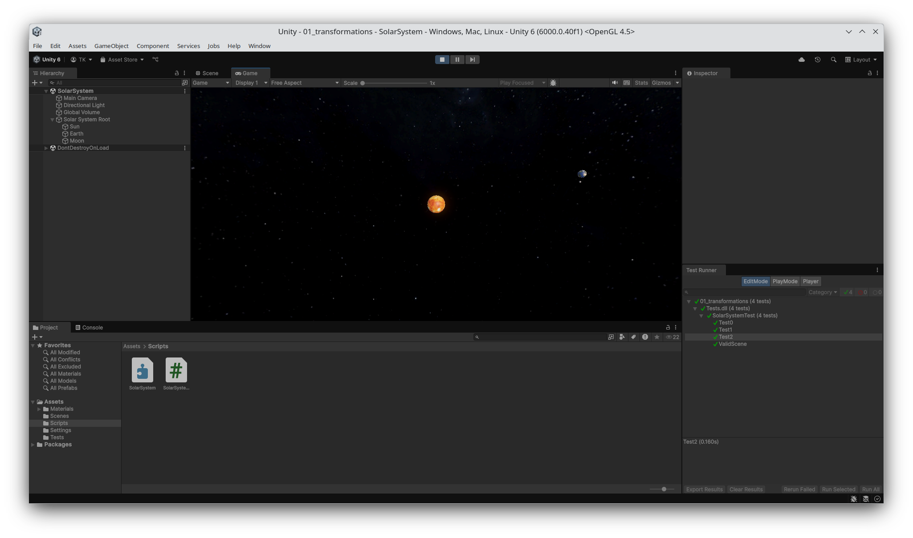
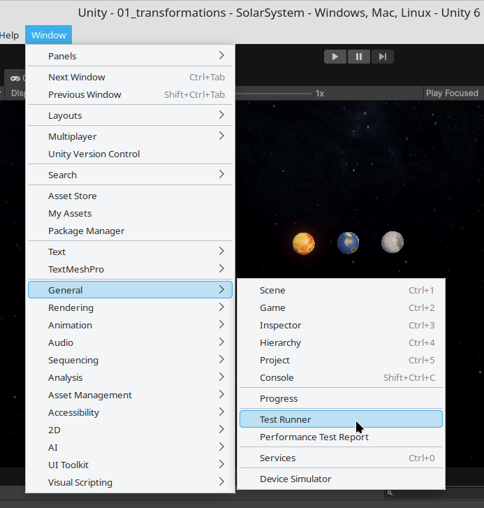
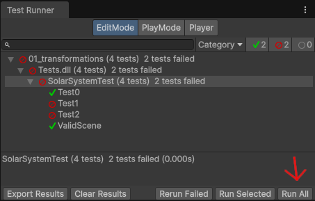

# Exercise - Transformations

In this exercise, you will learn how to manipulate the transformation of game objects in the Unity3D game engine.

## Setup on Pool Computers

The pool computers provide an installation of Unity Hub in `/opt/unityhub` and a Unity Editor in `/opt/unityeditor`.

When starting Unity Hub, you need to first create a Unity account. Upon completing this, you will be prompted to install an editor. Choose **"Locate Existing Installation"** and select the pre-installed editor (`/opt/unityeditor/6000.1.11f1/Editor/Unity`). You will be able to see the editor in UnityHub under "Installs" afterwards.

To add an existing project, select the "Projects" tab and choose "Add". Select the exercise folder with the project you want to open, and make sure you select the correct (already installed) editor if prompted. A few pop ups might open that ensure that you want to change the editor version of the project.

To open a project, click on it in the "Projects" tab in Unity Hub. Note that opening a project for the first time may take a while.

## Unity Editor Overview

This section gives a brief overview over the GUI of the unity editor.
The default layout of the editor is as follows:
In the center, you see the "Scene" view, where you can select and manipulate the placement of GameObjects manuall, as well as the "Game" view, which displays the image that will be visible to the player according to the camera(s) in the scene.
Note that you cannot manipulate objects via the Game view in case you accidentally select the tab.

Starting from the top-left in counter-clockwise order you find:

- "Hierarchy" view: Here the hierarchy of GameObjects in the current scene is shown.
E.g. there is a "Main Camera" and the "Solar System Root", and the "Sun", "Earth" and "Moon" are children thereof.
- "Project" view: Here you can explore the assets that are part of the project.
We have grouped them into the folders "Materials", "Scenes", "Scripts", "Settings" and "Tests.
- "Console" view: This is hidden as a tab behind the "Project" view.
Debug output including error messages and most importantly compiler errors are logged in the "Console" view.
- "Test Runner" view:  Not open by default, see below.
- "Inspector" view: Shows the properties of the selected object in the "Hierarchy" or "Project" view.

### Running Tests
To pass the exercise, test tests in the Unity project need to pass.
To open the test runner navigate to "Window->General->Test Runner".
To execute the tests, click the "Run All" button in the lower right corner.

### Coding in Unity

The programming will take place in C#, you only need to modify the `./Assets/Scripts/SolarSystemController.cs` script in your favorite code editor.
See the [Unity Documentation](https://docs.unity3d.com/ScriptReference/) for more details.
Since we are only manipulating transformations, have a closer look at the [Transform](https://docs.unity3d.com/ScriptReference/Transform.html) class.
It defines the transformation of a [GameObject](https://docs.unity3d.com/ScriptReference/GameObject.html) in relation to its parent.
The important properties are:

- [localPosition](https://docs.unity3d.com/ScriptReference/Transform-localPosition.html) to define the translation.
When defining a more complex transform, the [Translate](https://docs.unity3d.com/ScriptReference/Transform.Translate.html) method can be used to multiply an equivalent translation matrix to the current transformation matrix from the right (by default).
- [localRotation](https://docs.unity3d.com/ScriptReference/Transform-localRotation.html) or [localEulerAngles](https://docs.unity3d.com/ScriptReference/Transform-localEulerAngles.html) to define the rotation.
When defining a more complex transform, the [Rotate](https://docs.unity3d.com/ScriptReference/Transform.Rotate.html) method can be used to multiply an equivalent rotation matrix to the current transfromation matrix from the right (by default).
- [localScale](https://docs.unity3d.com/ScriptReference/Transform-localScale.html) to define the scaling in each direction.

## Task

The given scene `./Assets/Scenes/SolarSystem.unity`, contains three planetary objects: Sun, Earth and Moon.
Your task is to update the transformation of each `GameObject` in the `public void UpdateSolarSystem(float time)` method of `./Assets/Scripts/SolarSystemController.cs`, such that:

1. The sun rotates around itself every `sunRotationPeriod` time units, [c.f. Carrington Rotation](https://en.wikipedia.org/wiki/Solar_rotation#Carrington_rotation).
2. The earth rotates around the sun at the given `sunEarthDistance` every `sunEarthRotationPeriod` time units, and around itself every `earthRotationPeriod`.
3. The moon rotates around the earth at the given `earthMoonDistance` every `earthMoonRotationPeriod` time units, and around itself at the same speed as it rotates around the earth.
4. Each object should be scaled according to `{name}Radius`.

 

<h3>Good Luck!</h3>

