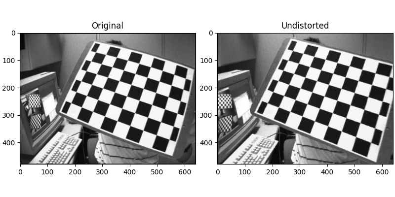

# Exercise - Transformations

In this exercise, you will learn how to undistort images yourself.

After completing the task, you should see the following results when running the `demo.py` example:



## Additional Information

Additional information on how the undistortion process works can be found in the [OpenCV Camera Calibration and 3D Reconstruction Guide](https://docs.opencv.org/4.x/d9/d0c/group__calib3d.html).
Keep in mind that you must not use OpenCV functions in your implementation though.

## Task

Implement the following functions, preferably in the given order:

1. `create_image_points` takes as an input the `width` and `height` of an image, and outputs a 2D array containing the x (colum) and y (row) coordinates of the respective pixels. The shape of the output array is `output.shape = (height, width, 2)`.
2. `apply_camera_matrix` and `apply_inverse_camera_matrix` multiply the camera matrix or inverse camera matrix from the left.
    The camera matrix is a 3x3 matrix, and you can assume the following format:

    ```python
    camera_matrix = [
        [fx, 0, cx],
        [0, fy, cy],
        [0, 0, 1]
    ]
    ```
    The input points are 2D points without homogeneous component, the same applies to the output points.
3. `distort_points` applies the distortion to 2D points in the camera coordinate system according to the vector of distortion coefficients.
    Refer to the [OpenCV Camera Calibration and 3D Reconstruction Guide](https://docs.opencv.org/4.x/d9/d0c/group__calib3d.html) to find out what the coefficients are! We only use the first 8 coefficients of the OpenCV camera model.
4. `remap` is given an `image` and the `distorted_points`, rounds the `distorted_points` to integer coordinates and accesses the source `image` to compute the undistorted output image.
    Make sure that you are only accessing valid coordinates in the input image, and replace any pixels with invalid out-of-bound `distorted_points` with a 0 color value.

## General Remarks

The exercise will be graded based on the amount of successful unit tests. To run them, use

```
nox -s tests
```

<br/>
<center><h3>Good Luck!</h3></center>
