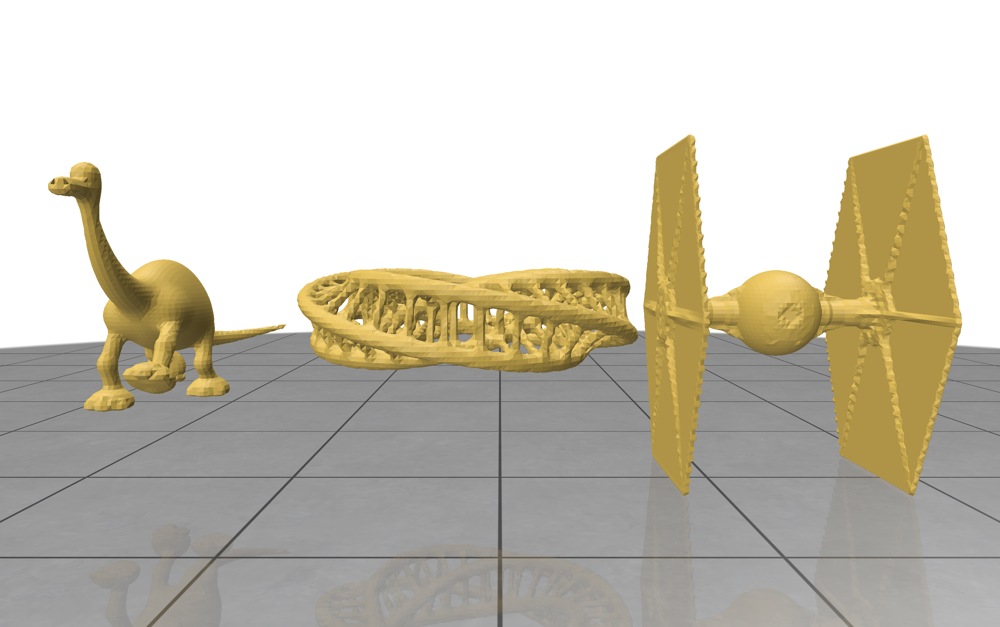

# Exercise - Marching Cubes

In this exercise, you will implement the Marching Cubes algorithm for extracting surfaces from scalar fields.

After completing the task, you should see the following result when running the `demo.py` example:




## Task

In `src/marching_cubes.py`:

1. Calculate the position of the neighboring voxels in the `neighboring_voxels` function based on the start voxel.
    The ordering of the points has to be following, where index 0 = `voxel_start`:

    ```
                                3------------2
                               /|           /|
        y                     / |          / |
        |                    7------------6  |
        |                    |  |         |  |
        O----x               |  0---------|--1
       /                     | /          | /
      z                      |/           |/
                             4------------5
    ```
2. From the input voxel grid, retrieve the SDF value of the neighboring voxels in the `collect_sdf_values` function.
3. In the `compute_marching_cubes_index` function, calculate the cube index by encoding the sign of each neighboring voxel as one bit.
   **Hint**: To set the `i`-th bit, `(1 << i)` together with bitwise operators might be useful.
4. Finally, implement the SDF-based interpolation of the edge vertices in the `interpolate_edge_vertex` function.


## General Remarks

The exercise will be graded based on the amount of successful unit tests. To run them, use

```
nox -s tests
```

<br/>
<center><h3>Good Luck!</h3></center>
