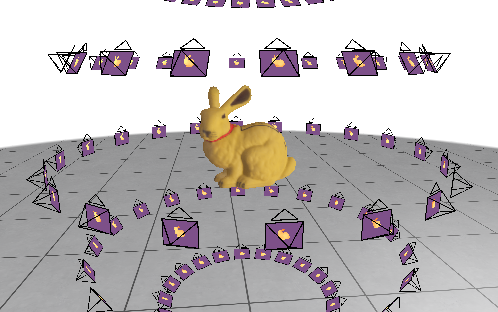

# Exercise - TSDF Fusion

In this exercise, you will implement the TSDF integration to fuse RGB-D images into a voxel grid.

After completing the task, you should see the following results when running the `demo.py` example:




## Task

In `src/tsdf_fusion.py`:

1. Project the grid points defined in the world coordinate system into pixel space in the `project_points` function.
2. In the `compute_tsdf_and_weight_from_depth` function, first calculate the SDF value of the grid point and then determine the TSDF value and weight from it:
    - TSDF: Avoid N/A (NaN) values and ensure that it always lies within the truncation region, i.e. $ \mathrm{tsdf} \in [-\mu, \mu] $
    - Weight: Implement the following simple weight function:
        $$
            w
            =
            \begin{cases}
                1 & \text{if } \mathrm{sdf} > - \mu \\
                0 & \text{otherwise}
            \end{cases}
        $$
3. Finally, implement the online update in the `integrate_values` function.


## General Remarks

The exercise will be graded based on the amount of successful unit tests. To run them, use

```
nox -s tests
```

<br/>
<center><h3>Good Luck!</h3></center>
