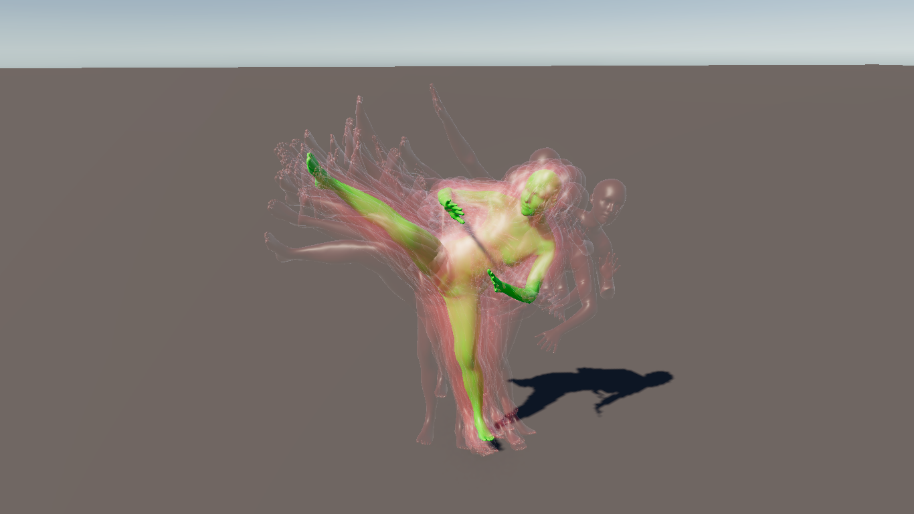

# Exercise - Human Models




In this exercise, you will work with SMPL models estimated by [CameraHMR](https://camerahmr.is.tue.mpg.de/) in Unity.

## CameraHMR

**NOTE:** It is advised to first implement the first three tasks below, before running CameraHMR yourself.

### Setup

**NOTE:** If you are working on the pool computers, you really, really don't want to store CameraHMR in your Home folder!
**The pretrained model data won't fit your home folder, it is approx. 12GB in size.**
We suggest to create a folder in `/tmp`, which, unfortunately, will be cleared every evening...
You could simply symlink the data folder of CameraHMR to `/tmp`:

```sh
mkdir -p /tmp/${USER}/CameraHMR_data
ln -s /tmp/${USER}/CameraHMR_data CameraHMR/data
```

We provide a *working* version of CameraHMR and its dependencies in this exercise framework.

To use CameraHMR, you need to install the dependencies

```sh
cd CameraHMR
# Install torch (As of right now, the pool computers support CUDA 12.5)
# Pytorch is already installed on the pool computers, you don't need to run this!
pip install torch torchvision torchaudio --index-url https://download.pytorch.org/whl/cu124
# Install requirements
pip install -r requirements.txt
```

Last but not least, you need to get the pretrained model weights.
The authors require you to create an account on their [homepage](https://camerahmr.is.tue.mpg.de/register.php) in order to download the weights.
After creating an account, simply run the following to download the weights (login credentials required):

```sh
# Download the trained model
bash scripts/fetch_demo_data.sh
```

We provide the script `setup.sh` that does all this for you. (Except creating the account)...


### Usage

Once you have a working copy of CameraHMR, we simply run **their** `CameraHMR/demo.py` script to estimate SMPL parameters from our images.
The provided images (and calibration data!) is located in the `Data/` folder.
From the `CameraHMR` folder, run the following scripts to estimate the human pose in each image:

```sh
python3 demo.py --image_folder ../Data/bonn_tele_bench_023_f00024 --output_folder ../Data/bonn_tele_bench_023_f00024_output
python3 demo.py --image_folder ../Data/bonn_tele_bench_023_c0012 --output_folder ../Data/bonn_tele_bench_023_c0012_output
# ... maybe run for more datasets
```
CameraHMR does not only write the SMPL parameters, but also a debug image and obj mesh.
Copy only the Json files into `Assets/Resources/bonn_tele_bench_${SUFFIX}`.

```sh
cd ..
rsync Data/bonn_tele_bench_023_f00024_output/*.json Assets/Resources/bonn_tele_bench_023_f00024
rsync Data/bonn_tele_bench_023_c0012_output/*.json Assets/Resources/bonn_tele_bench_023_c0012
```


## Exercise

Given the estimated SMPL parameters, your task is to import and visualize the generated human models into Unity.
For each dataset, we provide a Unity scene in `Assets/Scenes/` that you can use to manually run the code and  visually inspect your results.
Each scene contains an `SMPL Stage Static` object for tasks 1 and 2, and an `SMPL Stage Animation` object for task 3.

**NOTE:** The import scripts that you will implement require the VCI dome cameras to be instantiated.
In case you move or delete them, they can be regenerated by running the `Dome Instantiator` script that is attached to the `SMPL Stage *` objects.

**NOTE:** To run a script on an object, select the object in the Hierarchy View. The Button for running the script will appear on the right in the editor.


1. **Import a single pose.**
    First, we load a single set of parameters. The SMPL parameters are stored in a simple Json format:

    - "betas" stores the 10 shape parameters of the SMPL model.
    - "joints" stores 23 joint rotations as linearized 3x3 matrices.
    - "root_rot"/"root_trans" store the root transformation of the pose (wrt. the pelivs).

    In `Assets/Scripts/SMPLInstantiatorBase.cs` implement the `SMPLPose LoadSMPLPoseParams(TextAsset jsonAsset)` function.
    Hint: Feel free to make use of the `Utility.DecodeRotation` and `Utility.DecodeTranslation` methods.
    Hint: You can find the definition of the `SMPLPose` class in `Assets/Scripts/SMPLPose.cs`.
    With a correct implementation of this task, you should pass the first test and be able to import the red transparent poses by running the `SMPL Instantiator` script on the `SMPL Stage Static` object.

2. **Average the human models from each camera view.**
    As you have seen in the previous task, the estimates are not really consistent...
    In `Assets/Scripts/SMPLAverageInstantiator.cs` complete the `GameObject[] Run()` method.
    The shape parameters and root translation can be averaged with the arithmetic mean.
    For the joint angles and root rotation, take the mean quaternion representation and normalize it.
    With a correct implementation of this task, you should pass the second test and be able to import the green pose by running the `SMPL Average Instantiator` script on the `SMPL Stage Static` object.

3. **Import a sequence of human models as an animation.**
    Since we are dealing with video data in the end, we also want to have a look at the captured motion.
    We picked a "good" camera for you, and based on the first task, you already have a sequence of `SMPLPose` objects at hand.
    In `Assets/Scripts/SMPLInterpolator.cs` complete the function `void InterpolatePose()`:
    Given the `SMPLPose` objects adjacent to time parameter `t`, your task is to interpolate the parameters into a new pose.
    Shape parameters and the root translation can be interpolated linearly again.
    For the joint angles and root rotation, this is a little bit more tricky:
    Take the *relative* rotation, and linearly interpolate the angle in an angle-axis representation (c.f. [Quaternion.AngleAxis](https://docs.unity3d.com/6000.1/Documentation/ScriptReference/Quaternion.AngleAxis.html) and [Quaternion.ToAngleAxis](https://docs.unity3d.com/6000.1/Documentation/ScriptReference/Quaternion.ToAngleAxis.html)).
    With a correct implementation of this task, you should pass the third test and be able to import the animated model by running the `SMPL Animation Instantiator` script on the `SMPL Stage Animation` object.
    To view the animation, you can enter play mode in Unity.
    Alternatively you can select the imported game object and preview the animation using the `Animation Editor`, which you can open via `Window->Animation->Animation`.

4. **Run CameraHMR to extract SMPL parameters.**
    Now you should have the whole pipeline!
    Run CameraHMR on the provided images for the datasets `bonn_tele_bench_023_{f00024,c0012}` and copy the resulting Json files into the Unity project as described above in the CameraHMR usage section.
    Once the SMPL data is placed in the `Assets/Resources` folder, you can open the respective Unity scene and run the scripts from tasks 1-3 again.


<br/>
<center><h3>Good Luck!</h3></center>
