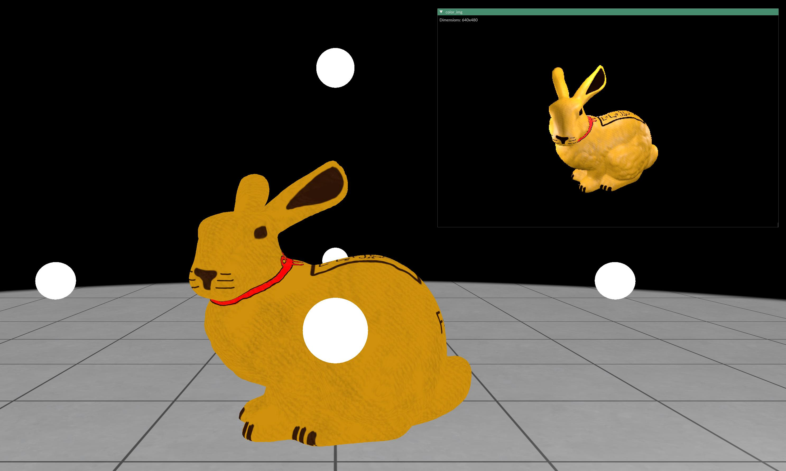

# Exercise - Forward Rendering

In this exercise, you will implement the physically-based BRDF to be used in a forward renderer.

After completing the task, you should see the following results when running the `demo.py` example:




## Task

In `src/forward_renderer.py`:

1. Implement the components of the physically-based BRDF in ```distribution_ggx```, ```geometry_ggx```, and ```fresnel_schlick```.
2. Use these components to implement the Cook-Torrance microfacet BRDF for the specular component and combine it with a diffuse BRDF in ```brdf```.
3. Implement the ```rgb_to_srgb``` function to convert the final rendered result to the sRGB color space.


## General Remarks

The exercise will be graded based on the amount of successful unit tests. To run them, use

```
nox -s tests
```

<br/>
<center><h3>Good Luck!</h3></center>
