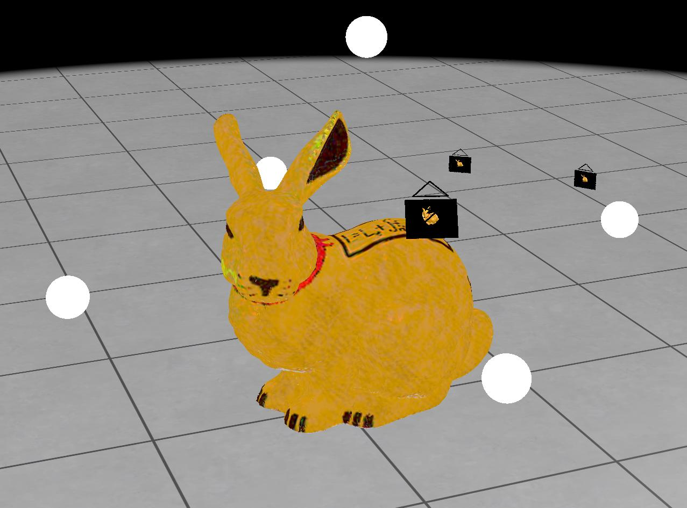

# Exercise - Differentiable Rendering

In this exercise, you will optimize the diffuse texture of an object using differentiable rendering.

After completing the task, you should see the bunny with an uninitialized texture. After some time, the optimization should look similar to this:



When enabling ```color_img```, you can see the rerendered version of the optimized material.

## Task

In `src/differentiable_renderer.py`:

1. Implement the conversion from an OpenCV projection matrix $K$ to an OpenGL Clip-Space Projection $P_{\mathrm{clip}}$.
2. Implement the gradient descent update step in ```gradient_descent```.
3. Compute the $L_1$-Loss between the estimated image and the target image in ```loss_L1```. Reduce the pixel-wise loss to a scalar using a sum reduction.
4. Implement the optimization step in ```optimize_step``` by rendering the image from each given camera view and accumulating the loss.


## General Remarks

The exercise will be graded based on the amount of successful unit tests. To run them, use

```
nox -s tests
```

<br/>
<center><h3>Good Luck!</h3></center>
